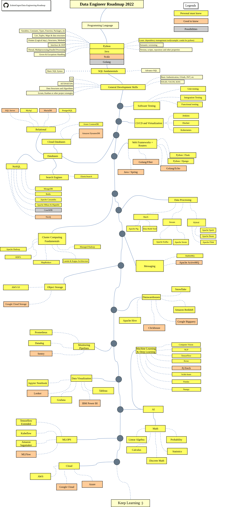

## Disclaimer
> The purpose of this roadmap is to give you an idea about the landscape. The road map will guide you if you are confused about what to learn next, rather than encouraging you to pick what is hype and trendy. You should grow some understanding of why one tool would be better suited for some cases than the other and remember hype and trendy does not always mean best suited for the job.
## Give a Star! :star:
If you like or are using this project to learn or start your solution, please give it a star. Thanks!
## Roadmap

## Programming Languages
* [Python Roadmap](https://github.com/ErdemOzgen/Python-developer-roadmap) 
* [Java Roadmap](https://github.com/s4kibs4mi/java-developer-roadmap)
* [Scala Docs](https://docs.scala-lang.org/)
* [Golang Roadmap](https://github.com/Alikhll/golang-developer-roadmap)

## Learn Linux

**There is two main parts for Linux learning: System Administration and Shell Scripting. You can arrange your learning depth with your preference**
* [Linux Bible, 10th Edition from Christopher Negus](https://www.wiley.com/en-us/Linux+Bible,+10th+Edition-p-9781119578895#content-section)
* [Linux Command Line and Shell Scripting Bible, 4th Edition from Richard Blum, Christine Bresnahan](https://www.wiley.com/en-gb/Linux+Command+Line+and+Shell+Scripting+Bible%2C+4th+Edition-p-9781119700937)

## Data Structures and Algorithms / System Design
* [Neetcode Leetcode](https://github.com/neetcode-gh/leetcode) ==> use for all languages you learned.
* [Desing Patterns](https://refactoring.guru/)
* [Interview University](https://github.com/jwasham/coding-interview-university)
* [Data Structures and Algorithms Book recommendation](https://github.com/jwasham/coding-interview-university#books-for-data-structures-and-algorithms)

## SQL
There are a number of good introductory SQL resources available for free and online. There are also some paid resources which I recommend for beginners, that are very effective, and well worth expensing in my opinion.
A couple of notes: 
- I haven’t used all of these resources, but they come with strong recommendations around the web or myself/my peers. 
- You absolutely don’t need to use every single resource. Find a couple that work for you, and go to town.
- You can always reach out to me if you have questions. I always paste this online when people are new to asking very technical questions – it’s not meant to be snarky – it's a gentle guide on how to compose your questions and gather necessary resources in order to best give technical people the information needed to get a quick/effective response:  http://www.mikeash.com/getting_answers.html
#### Video/Class/Mini-course based:
1. [Stanford Self-paced ‘Database’ course](https://class.stanford.edu/courses/DB/2014/SelfPaced/about)
  - The original Coursera coursed has been converted into a series of mini-courses, which are all self-paced, and thorough.
2. Portnov Computer School "SQL Tutorial for beginners”
  This is a mini-course (~4 hours in total) which is said to be quite good.
  Links:
    - Video 1: https://www.youtube.com/watch?v=xaRrTBmMp30
    - Video 2: https://www.youtube.com/watch?v=1sMR2ApQVvw
    - Video 3: https://www.youtube.com/watch?v=deegPjmasq8
    - Video 4: https://www.youtube.com/watch?v=vHE-EeLaYsI
#### Book/Tutorial Format (some interactive):
1. [SQL Problems and Solutions – Interactive book](http://www.sql-tutorial.ru/)
  “…student[sic] can ask questions and get the answers even if such answers cannot be found in the textbook. To a certain extent interactive textbook is intended to substitute a teacher/advisor, which is, to our mind, indispensable requirement for the use of such teaching materials within the system of distance learning"
2. [Learn SQL The Hard Way](http://sql.learncodethehardway.org/)
  "This book will teach you the 80% of SQL you probably need to use it effectively, and will mix in concepts in data modeling at the same time. If you've been fumbling around building web, desktop, or mobile applications because you don't know SQL, then this book is for you. It is written for people with no prior database, programming, or SQL knowledge, but knowing at least one programming language will help."
3. [GalaXQL](http://sourceforge.net/projects/galaxql/)
  "GalaXQL is a fun SQL tutorial where the database is a galaxy of stars that is rendered in 3D. Watch the galaxy change as your SQL commands create, modify, and destroy heavenly objects. What could be more fun?"
4. [PostgreSQL Tutorial](http://www.postgresqltutorial.com/)
  "We developed the PostgreSQL tutorial to demonstrate the unique features of PostgreSQL that make it the most advanced open source database management system in the world. In addition, we will show you how to leverage those features to make your application faster and more secure."
5. [Head First SQL](http://www.headfirstlabs.com/books/hfsql/)
  An excellent resource for beginners, I went through years ago. I highly recommend picking up a copy if you truly want to start at the ground level. It’s a big book, but the font size is large, and there are exercises / pictures etc. It takes about 1-2 days to get through, maybe a week spread out.
  “Is your data dragging you down? Are your tables all tangled up? Well we've got the tools to teach you just how to wrangle your databases into submission. Using the latest research in neurobiology, cognitive science, and learning theory to craft a multi-sensory SQL learning experience, Head First SQL has a visually rich format designed for the way your brain works, not a text-heavy approach that puts you to sleep.
  Maybe you've written some simple SQL queries to interact with databases. But now you want more, you want to really dig into those databases and work with your data. Head First SQL will show you the fundamentals of SQL and how to really take advantage of it. We'll take you on a journey through the language, from basic INSERT statements and SELECT queries to hardcore database manipulation with indices, joins, and transactions. We all know "Data is Power"—but we'll show you how to have "Power over your Data". Expect to have fun, expect to learn, and expect to be querying, normalizing, and joining your data like a pro by the time you're finished reading!"
#### Practice resources:
1. [SchemaVerse](https://schemaverse.com/)
  "The Schemaverse is a space-based strategy game implemented entirely within a PostgreSQL database. Compete against other players using raw SQL commands to command your fleet. Or, if your PL/pgSQL-foo is strong, wield it to write AI and have your fleet command itself!"
2. [SqlEx](http://www.sql-ex.ru/)
  An extension of the sql-tutorial.ru book with practice exercises.
3. [SQLZoo](http://sqlzoo.net/wiki/Main_Page)
  Some tutorials and practice exercises
4. [PostgreSQL Exercises](http://pgexercises.com/index.html)
  "This site was born when I noticed that there's a load of material out there to help people learn about SQL, but not a great deal to make it easy to learn by doing. PGExercises provides a series of questions and explanations built on a single, simple dataset. It's designed for use as a partner to a good book or Postgres' excellent documentation.
  The exercises on this site range from simple select and where clauses, through joins and case statements, and on to aggregations, window functions, and recursive queries. Most people who aren't already pros should find something to test themselves with."

## Testing 

* Unit Testing
* Integration testing
* Functional testing
* [Agile Testing: A Practical Guide for Testers and Agile Teams](https://www.amazon.com/Agile-Testing-Practical-Guide-Testers/dp/0321534468)
* [The Art of Software Testing](https://www.amazon.com/Art-Software-Testing-Glenford-Myers/dp/1118031962)

## CI/CD and Virtualization

* [Ansible](https://www.ansible.com/)
* [Jenkins](https://www.jenkins.io/)
* [Docker](https://www.docker.com/)
* [Kubernetes](https://kubernetes.io/)
* [Terraform](https://www.terraform.io/)
* [Aws CDK](https://aws.amazon.com/cdk/)

## Database Fundamentals

* [SQL](#sql)
* Normalisation
* ACID transactions
* CAP Theorem
* OLTPS vs OLAP
* Horizontal vs Vertical Scaling
* Dimensional Modeling

## Relational Database

* [MySQL](https://www.mysql.com/)
* [PostgreSQL](https://www.postgresql.org/)
* [MariaDB](https://mariadb.org/)
* [Amazon Aurora](https://aws.amazon.com/rds/aurora/)

## Non-Relational Databases

* Document
    * [MongoDB](https://www.mongodb.com/)
    * [Elasticsearch](https://www.elastic.co/)
    * [Apache CouchDB](https://couchdb.apache.org/)
    * [Azure CosmosDB](https://learn.microsoft.com/en-us/azure/cosmos-db/)
* Wide Column
    * [Apache Cassandra](https://cassandra.apache.org/_/index.html)
    * [Apache HBase](https://hbase.apache.org/)
    * [Google Bigtable](https://cloud.google.com/bigtable)
* Graph
    * [Neo4j](https://neo4j.com/)
    * [Amazon Neptune](https://aws.amazon.com/neptune/)
* Key-Value
    * [Redis](https://redis.io/)
    * [Memcached](https://memcached.org/)
    * [Amazon DynamoDB](https://aws.amazon.com/dynamodb/)

## Data Processing

* Batch
    * Apache Pig
    * Data Build Tool

* Stream
    * Apache Kafka
    * Apache Storm

* Hybrid
    * Apache Spark
    * Apache Beam
    * Apache Flink

## Messaging

* RabbitMQ
* Apache ActiveMQ

## Cluster Computing Fundamentals

* Apache Hadoop
* HDFS
* MapReduce
* Lambda & Kappa Architecture
* Managed Hadoop

## Object storage

* AWS S3
* Google Cloud Storage

## Datawarehouses

* Snowflake
* Amazon Redshift
* Apache Hive
* Google BigQuery
* ClickHouse

## Monitoring Datapipelines

* Prometheus
* Datadog
* Sentry

## Data Visualization

* Jupyter Notebook
* Looker
* Grafana
* Tableau
* IBM Power BI

## Machine Learning and Deep Learning Tools

* Math
* Statistics and Probability
* Pandas
* NumPy
* Tensorflow
* Keras
* Pytorch
* Scikit-learn
  * #### Data Science Resources
  - :books: [DPhi-Data Science Courses](https://dphi.tech/)
  - :books: [Data Science Methodology](https://cognitiveclass.ai/courses/data-science-methodology-2)
  - :bulb: [Data Science Cheat Sheets](https://www.kaggle.com/timoboz/data-science-cheat-sheets)
  - :books: [IBM Data Science Coursera](https://www.coursera.org/professional-certificates/ibm-data-science)
  - :video_camera: [Introduction to Data Science with R](https://www.youtube.com/watch?v=32o0DnuRjfg&list=PLTJTBoU5HOCRrTs3cJK-PbHM39cwCU0PF&index=1)
  - :bulb: [Machine Learning Algorithms from Scratch](https://github.com/python-engineer/MLfromscratch)
  - :books: [Python for Data Science: Fundamentals](https://www.dataquest.io/course/python-for-data-science-fundamentals)
  - :books: [Python for Data Science: Intermediate](https://www.dataquest.io/course/python-for-data-science-intermediate/)
  
	
  * #### Machine Learning Resources
  - :books: [Google's Machine Learning Crash Course](https://developers.google.com/machine-learning/crash-course/)
  - :books: [Andrew Ng's Machine Learning Coursera Course](https://www.coursera.org/learn/machine-learning)
  - :books: [Intro to Machine Learning](https://www.kaggle.com/learn/intro-to-machine-learning)
  - :books: [Intermediate Machine Learning](https://www.kaggle.com/learn/intermediate-machine-learning)
  - :books: [Understanding Machine Learning: From Theory to Algorithms](https://www.cs.huji.ac.il/~shais/UnderstandingMachineLearning/copy.html)
  - :books: [Probability and Statistics](https://ocw.mit.edu/courses/mathematics/18-05-introduction-to-probability-and-statistics-spring-2014/index.htm)
  - :books: [freecodecamp's courses for machine learning](https://www.freecodecamp.org/learn/)
  - :bulb: [A quick review of the linear algebra concepts relevant to machine learning.](http://www.deeplearningbook.org/contents/linear_algebra.html)
  - :books: [Calculus](http://cs231n.stanford.edu/handouts/derivatives.pdf)
  - :books: [Statistical concepts for machine learning](http://www-bcf.usc.edu/~gareth/ISL/)
  - :bulb: [AWS Machine Learning Tools](https://www-freecodecamp-org.cdn.ampproject.org/c/s/www.freecodecamp.org/news/aws-machine-learning-tools-the-complete-guide/amp/)
  - :green_book: [Introductory Primer](https://www.toptal.com/machine-learning/machine-learning-theory-an-introductory-primer)
  - :bulb: [Machine Learning Roadmap](https://whimsical.com/machine-learning-roadmap-2020-CA7f3ykvXpnJ9Az32vYXva)
  - :books: [TinyML Course](https://www.edx.org/professional-certificate/harvardx-tiny-machine-learning)
  - :books: [Machine Learning Introduction with Python](https://www.dataquest.io/path/machine-learning-intro-with-python/)
  - :speaker: [Machine Learning Guide Podcast](https://ocdevel.com/mlg)

  * ##### Deep Learning Resources
  - :books: [Andrew Ng's Deep Learning Specializations Course](https://www.coursera.org/specializations/deep-learning)
  - :green_book: [Convolutional networks CS231n](https://cs231n.github.io/convolutional-networks/)
  - :books: [Deep Learning Fundamentals](https://www.dataquest.io/course/deep-learning-fundamentals/)
  - :bulb: [Deep learning cheat sheet](https://stanford.edu/~shervine/teaching/cs-229/cheatsheet-deep-learning)
  - :books: [Natural Language Processing CS224n](http://web.stanford.edu/class/cs224n/)
  - :books: [IBM Deep Learning Course with certification](https://cognitiveclass.ai/courses/introduction-deep-learning) 

## MLOPS tools

* Tensorflow Extended
* Kubeflow
* Amazon Sagamaker
* MLflow

## Cloud 

* AWS
* Google Cloud
* Azure

	
## Wrap Up
If you think the roadmap can be improved, please do open a PR with any updates and submit any issues. Also, I will continue to improve this, so you might want to star this repository to revisit.
Idea from : [Python Developer Roadmap](https://github.com/ErdemOzgen/Python-developer-roadmap)
## Contribution
The roadmap is built using [Draw.io](https://www.draw.io/). Project file can be found at `DataEngRoadmap.xml` file. To modify it, open draw.io, click **Open Existing Diagram** and choose `xml` file with project. It will open the roadmap for you. Update it, upload and update the images in readme and create a PR (export as png with 400% zoom and minify that with [Compressor.io](https://compressor.io/compress)).
- Open a pull request with improvements
- Discuss ideas in issues
- Spread the word